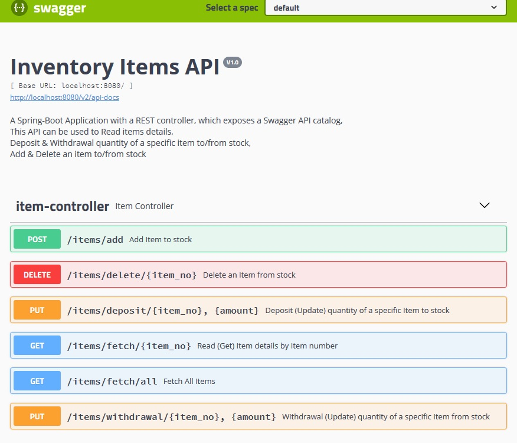
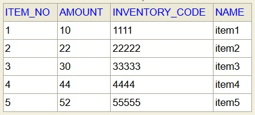

# spring-boot-swagger-application
A Spring-Boot Application with a REST controller, which exposes a Swagger API catalog.

The Application represent a List of Inventory items.
This is a simple MVC project with a basic REST controller, which exposes a Swagger API catalog.

All of the Data is stored on H2 Data Base using JPA, in Table 'Inventory' and contain the following columns:  
    
    • item no - the item number, this is also a primery key for the table.
  
    • name - the name of the item.
  
    • amount - amount of the item.
   
    • inventory code - an inventory code for each item.
  

The application packed and can run from docker container.

The following methods implemented and working well:

• Get a list of all items with details  - using a GET request to get a JSON code of all items from Invantory table.

    mapping: "/items/fetch/all"

• Read item details (by item_no) - using a GET request to get a JSON code of a specific item from Invantory table by using item_no (primary key).

    mapping: "/items/fetch/{item_no}"

• Withdrawal quantity of a specific item from stock (by item_no) - Using PUT request to withdrawal a requested amount from the inventory table by giving 2 arguments: item_no, amount. 
*It is allowed to withdraw the requested amount only if there is enough in stock.

    mapping: "/items/withdrawal/{item_no}, {amount}"

• Deposit quantity of a specific item to stock (by item_no) - Using PUT request to deposit a requested amount to the inventory table by giving 2 arguments: item_no, amount. 

    mapping: "/items/deposit/{item_no}, {amount}"

• Add item to stock - Using POST request to add a new item to the inventory table by giving 4 arguments: item_no, name, amount, inventory code.

    mapping: "/items/add"

• Delete an item from stock -  Using DELETE request to delete a record (an item) from the inventory table by item_no. 

    mapping: "/items/delete/{item_no}"
